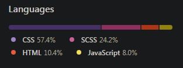

# Clone_Project
___
> Languages



> 클론 사이트

원작 사이트의 링크 [KGC인삼공사](https://www.kgc.co.kr/index.do)


> 기획 의도 

* 실제 현업에서 어떠한 UI/UX를 구현하는지 세세한 관찰과 연구 목적

* 난이도가 있는 기능 구현 연습​

* 팀 프로젝트 진행 시, 팀원간에 코드 스킬 이해도 상승​

> 주요 기능

* **Canvas** 태그 제어
```
function draw(){
    // ctx.drawImage(image,  sx, sy, sWidth, sHeight, dx, dy, dWidth, dHeight);
    const canvas_prev = document.querySelector(".main_video .next");
    const context = canvas_left_prev.getContext("2d");

    left_endpoint = ( windowWidth / 2 ) + 240 * ( num - 2 );
    right_startpoint = left_endpoint;
    
    context.clearRect(0, 0, canvas_left_prev.width, canvas_left_prev.height );

    context.drawImage(video, 0, 0, xPos1, 1080,  0, 0, xPos1, canvas_left_prev.height);
    context.drawImage(video, left_endpoint, 0, 1920-left_endpoint, video_Height, 
                        right_startpoint, 0, xpos2, video_Height);

    if(xPos1 < left_endpoint){
        xPos1 += 40;
    }
    if(xpos2 < canvas_left_prev.width - left_endpoint){
        xpos2 += 40;
    }
    requestAnimationFrame(draw);
}
```

* **Swiper** Plugin 사용
```
let con3_swiper_right = new Swiper("#right_content", {
        speed: 500,
        spaceBetween: 0,
        slidesPerView: 1,
        centeredSlides: true,
        direction: "vertical",
        loop: true,
        autoHeight: true,
        autoplay: {
            delay: 7000,
            disableOnInteraction: false,
        },
        navigation: {
            nextEl: ".swiper-button-next",
            prevEl: ".swiper-button-prev",
        },
    });

    //슬라이더 변경 될 시, 실행되는 함수
    con3_swiper_right.on("slideChange", function(){
        sub_text_hide();
        text_loop_num = con3_swiper_right.realIndex;
        sub_text_animation();
    })
```
* **Slide** 제작

> GithubPage

클론페이지 [바로가기](https://dlsdk0601.github.io/clone_Project/)


