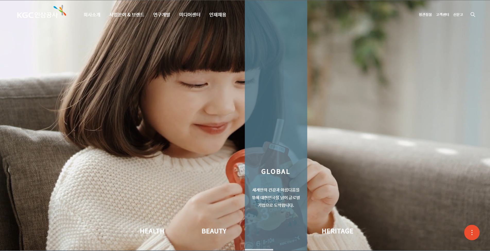
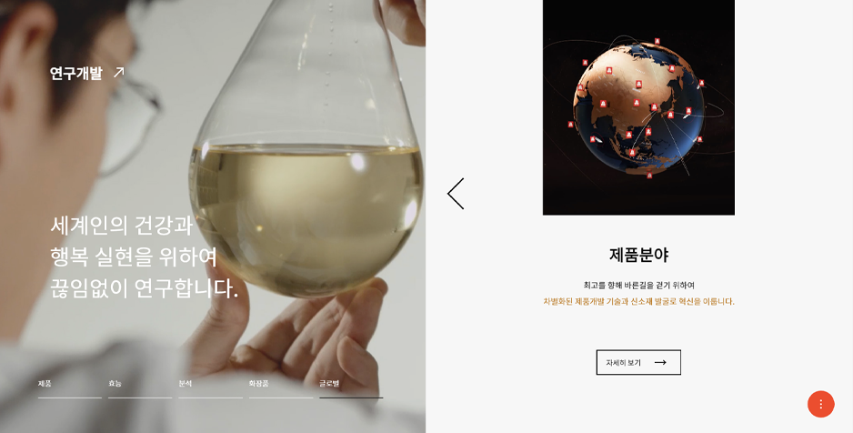
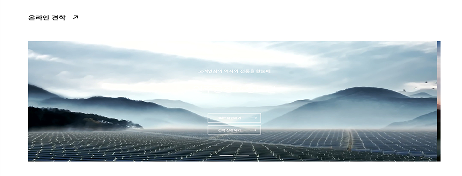

# Clone_Project

> Skill

HTML, SCSS, Vanilla JS
<br><br>

> 클론 사이트

원작 사이트의 링크 [KGC인삼공사](https://www.kgc.co.kr/index.do)
<br><br>
> 기획 의도 

* 실제 현업에서 어떠한 UI/UX를 구현하는지 세세한 관찰과 연구 목적

* 난이도가 있는 기능 구현 연습​

* 팀 프로젝트 진행 시, 팀원간에 코드 스킬 이해도 상승​
<br><br>
> 제작 기간

* 2021.08
 <br><br>
> 주요 기능

* **Canvas** 태그 제어
```
    ctx.drawImage(image,  sx, sy, sWidth, sHeight, dx, dy, dWidth, dHeight);
```
클론 프로젝트에서 핵심 기능은 Canvas 태그입니다. 
일반 video 태그만 이용하여 단순한 영상 재생만 하는것이 아닌, 
비디오 drawImage를 이용하여 다양한 애니메이션 효과를 적용 할 수 있습니다.
drawImage를 이용하여 canvas 태그를 컨트롤 하는 함수를 만들어 setInterval을 통해 
해당 배너와 같이 실행이 되도록 구성하였습니다.<br><br> 
<br>

---

* **Swiper** Plugin 사용

swiper 플러그인을 가져와 사용했습니다.<br><br>
<br><br>

---

* **Slide** 제작

slide기능은 플러그인으로 쉽게 가져올 수 있지만, 그 원리를 알아야한다고 생각합니다. 이번 프로젝트에서 한 페이지에 2개의 슬라이드가 존재하여,
하나는 플러그인, 하나는 순수 자바 스크립트로 제작하였습니다.<br><br>
<br><br>
> GithubPage

클론페이지 [바로가기](https://dlsdk0601.github.io/clone_Project/)


